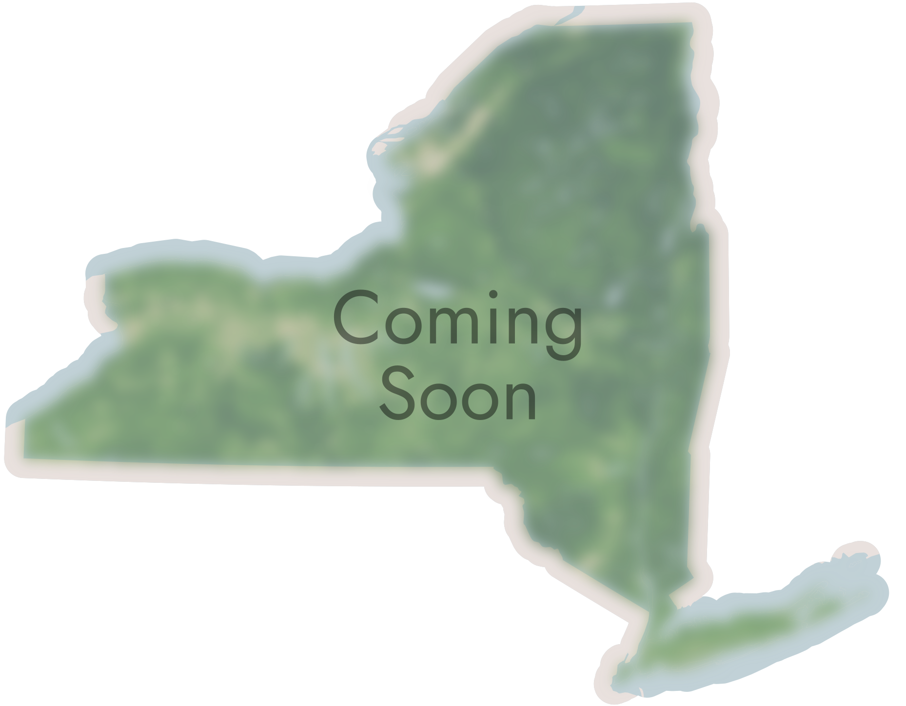
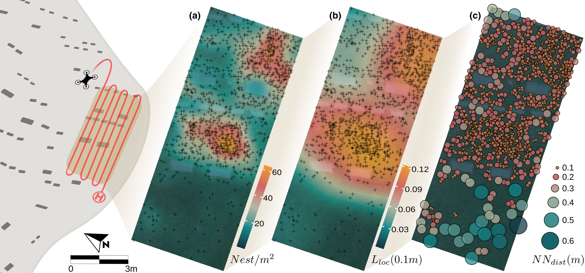
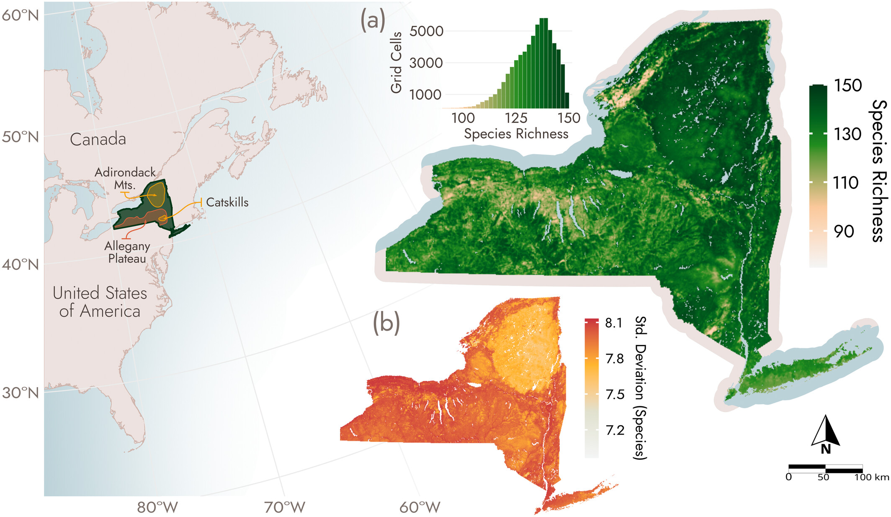
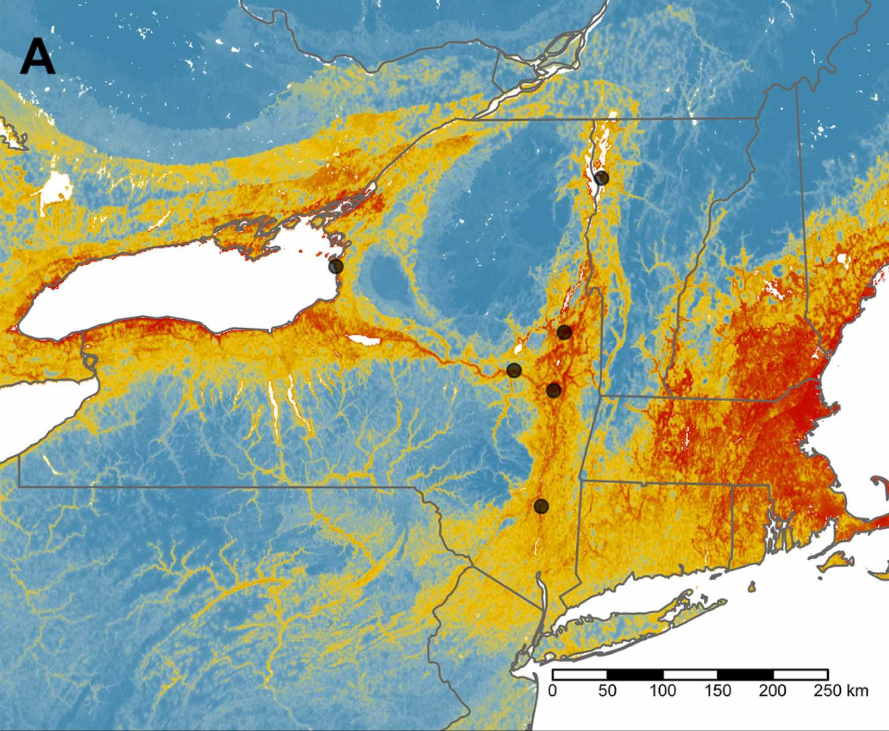
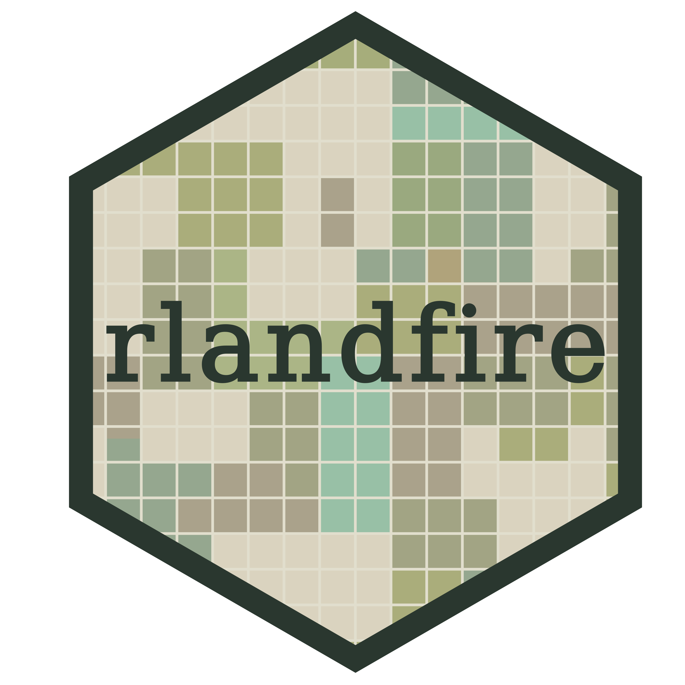

::: {.grid .column-page}
::: {.headline .g-col-lg-6 .g-col-12 .g-col-md-12}

# Research and Current Projects

Explore some of my recent and ongoing projects.

-   Rapid, cost effective monitoring with UAVs and computer vision

-   Occupancy forecasting with deep learning models

-   `rlandfire`: Interface to 'LANDFIRE Product Service' API 

-   Modeling the diversity and distribution of NYS Bees


:::

```{r}
#| classes: '.g-col-lg-6 .g-col-12 .g-col-md-12'

source("carousel.R")

carousel("projects-carousel", 5000, yaml.load_file("carousel.yml"))

```
:::

::: {.grid .column-page}
::: {.g-col-12}
## Ongoing Research
```{=html}
<div>
  <div style="float: left; position: relative; top: 10px; padding:10px;">
  
  <br>
  </div>
<br>
<h4> Decision support for a threatened fish supplementation program </h4>

Conservation of threatened and invasive species requires decision making under uncertainty. Working in affiliation with researchers and managers at the USGS, USBR, USFWS and state agencies, I am working to develop a transparent value of information (VOI) analysis to identify priority research areas for the supplementation of a federally and state-listed species in California's Sacramento Delta. 

</div>

<br>
```

```{=html}
<div>
  <div style="float: left; position: relative; top: 10px; padding:10px;">
  
  <br>
  </div>
<br>
<h4> Occupancy forecasting with deep learning models in agriculture </h4>

Early warning forcasts for migratory pest species benefit from rapid, computationally efficient models with clearly reported uncertainty. I am leading the development of a variation deep learning occupancy forecasting architecture which integrating presence-only and monitoring network data to generate weekly forecasts of pest occupancy probabilities across the eastern United States.

</div>

<br>
```

## Previous Research

During my PhD, I used open data to model how the diversity and distributions of solitary bees may change under future climate conditions and in human-altered landscapes. By evaluating how species respond to the changing environment, I generated data products for land management decision-making and biodiversity conservation.

Historically, insect populations lacked detailed, structured, and long-term surveys. The need for more data presents a challenge in prioritizing conservation action. By leveraging community science data and collection records with Species Distribution Modeling (SDM), we can better evaluate how species may respond to a suite of interacting drivers of global change.

```{=html}
<div>
  <div style="float: left; position: relative; top: 10px; padding:10px;">
  
  <br>
  </div>
<br>
<h4> UAV‐based remote sensing of bee nesting aggregations with computer vision for object detection </h4>

Traditional methods for monitoring solitary ground nesting bee aggregations is labor-intensive and provides limited, often coarse, metrics. We introduced a novel high throughput method for rapid, cost-effective monitoring using UAV-based imagery and computer vision. <a href="https://doi.org/10.1111/1365-2664.70285">Journal of Applied Ecology</a>.

</div>

<br>
```

```{=html}
<div>
  <div style="float: left; position: relative; top: 10px; padding:10px;">
  
  <br>
  </div>
<br>
<h4> Mapping bee diversity with landscape‐level models to inform conservation </h4>

The local context required for implementing effective conservation actions is often missing from global analyses of bee diversity. Using records from the Empire State Native Pollinator Survey and GBIF, we modeled how bee species are distributed across the state of New York and what habitats may be of high conservation value. Read the paper in <a href="https://doi.org/10.1111/csp2.70239">Conservation Science and Practice</a>.

</div>

<br>
```

```{=html}
<div>
  <div style="float: left; position: relative; top: 10px; padding:10px;">
  
  <br>
  </div>
<br>
<h4> Forecasting the Impacts of Global Change on a Bee Biodiversity Hotspot </h4>

The American Southwest is a hotspot for rapid climate change, land conversion, and bee biodiversity. Home to nearly 1/4 of US bee species, we are using Joint SDMs to evaluate how global change might impact species richness in the region and how to mitigate the threat. Read the paper in <a href="https://doi.org/10.1002/ece3.70638">Ecology and Evolution</a>.

</div>

<br>
```


```{=html}
<div>
  <div style="float: left; position: relative; top: 30px; padding:10px;">
  
       <br><br>
  </div>
<br>
<h4> Climate-driven range shifts in a rare specialist bee </h4>
Most specialists bees collect pollen from species within the same family of plants. <i>Macropis nuda</i> only collects pollens and oils from a couple of species. Our recent Global Ecology and Conservation <a href="https://doi.org/10.1016/j.gecco.2022.e02180">publication</a> explored how this species and its primary host plant might respond to the changing climate. 
</div>

<br>
```


## Software

```{=html}
<div>
  <div style="float: left; position: relative; top: 10px; padding:10px;">
  
  </div>
<br>
<h4> rlandfire </h4>
  <br>
<code>rlandfire</code> is an R package for working with the 'Landscape Fire and Resource Management Planning Tools' (LANDFIRE) geospatial layers in R. The current version provides and interface to the 'LANDFIRE Product Service' API from within R. 
<br>
</div>

<br>
```

`rlandfire` is now on [CRAN](https://cran.r-project.org/package=rlandfire)! The package can be installed with:

```{r}
#| eval: false
#| echo: true

# CRAN:
install.packages("rlandfire")

# Development version:
# install.packages("devtools")
devtools::install_github("bcknr/rlandfire")
```
Please submit all bug reports, feature requests, or questions on the [GitHub repo](https://github.com/bcknr/rlandfire/issues).

I am open to contributors. If you are a LANDFIRE user and are interested in participating, please reach out!

:::
:::
```{=html}

<style>

.headline p {

  margin: 0;

  padding-bottom: 0.2rem;

}


.carousel.card {

  padding-top: 2em;

}

.carousel img {

  width: 70%;

  margin-bottom: 110px;

}

.carousel-control-prev-icon, .carousel-control-next-icon {

  margin-bottom: 110px;

}

.carousel-caption {

  padding-top: 1em;

}


</style>
```
